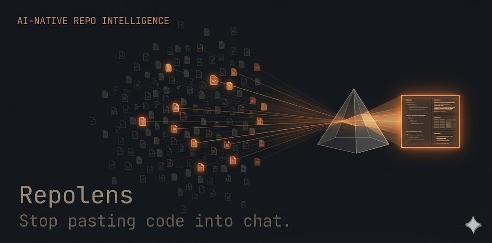

# Repolens v2

[](https://www.python.org/downloads/)
[](LICENSE)
[](https://www.anthropic.com)

AI-native repo intelligence. Ingests a local git repository, classifies and scores every file, builds token-budgeted context bundles, and runs Anthropic Claude tasks against that context — from a Python CLI or a thin FastAPI layer. Local-first, single SQLite file, no cloud, no auth.

Built to replace the pattern of pasting entire codebases into chat windows.

---

## Status

- Roadmap: 22 tasks, all done.
- Schema version 3 (cache-aware run + summary accounting).
- Default model: `claude-opus-4-7`.
- Prompt caching enabled by default for system-block prefixes over the model family threshold.

---

## Why Repolens?

| The Old Way | The Repolens Way |
|---|---|
| Paste whole codebases into chat — expensive, lossy, context blown | Importance-scored files packed inside a token budget *you* set |
| Re-pay for the same tokens every conversation | Prompt caching reduces repeat `run` input cost ~75-85% (validated end-to-end) |
| Guess what files matter; forget the one that does | Deterministic rules + scoring; same inputs → same bundle |
| Cost is invisible until the bill arrives | Every run logs tokens + USD; `--dry-run` previews before you spend |
| Conversation-shaped, not reproducible | CLI + SQLite audit trail; a teammate can replay your exact context |

---

## Install

Requires Python 3.12+ and SQLite 3.38+.

```bash
python3 -m venv .venv
source .venv/bin/activate
pip install -e ".[dev]"
```

---

## Environment

| Variable                       | Default                           | Purpose                                                                 |
|--------------------------------|-----------------------------------|-------------------------------------------------------------------------|
| `ANTHROPIC_API_KEY`            | (required for AI commands)        | Anthropic key.                                                          |
| `REPOLENS_MODEL`               | `claude-opus-4-7`                 | Default Claude model.                                                   |
| `REPOLENS_MAX_TOKENS`          | `4096`                            | Max completion tokens per call.                                         |
| `REPOLENS_TOKEN_BUDGET`        | `32000`                           | Context-bundle token budget.                                            |
| `REPOLENS_DB`                  | `~/.repolens/repolens.db`         | SQLite file location.                                                   |
| `REPOLENS_TIMEOUT`             | `60`                              | SDK HTTP timeout in seconds.                                            |
| `REPOLENS_MAX_RETRIES`         | `2`                               | SDK retry count for transient failures.                                 |
| `REPOLENS_ACCURATE_TOKENS`     | unset                             | Set to `1` to route `count_tokens` through Anthropic's native endpoint. |

Copy `.env.example` to `.env` and fill in `ANTHROPIC_API_KEY`.

---

## Quickstart

```bash
# Register a local repo and scan it into the DB.
repolens ingest ~/my-project

# Run rules-based classification and importance scoring.
repolens classify my-project

# Generate AI summaries at file / dir / repo scope (uses prompt cache).
repolens summarize my-project --scope all

# Build a token-budgeted context bundle (no AI call yet).
repolens context my-project --task analyze --budget 32000 --output /tmp/ctx.md

# Run an AI task against the bundle, log tokens and cost.
repolens run my-project --task analyze --description "what does this repo do?"

# Inspect recent runs.
repolens runs my-project --limit 5
```

---

## Demo


End-to-end run on a small Python repo: ingest → classify → summarize → context → run, with cache and cost accounting visible at every step.

---

## CLI reference

| Command      | Purpose                                                                  |
|--------------|--------------------------------------------------------------------------|
| `ingest`     | Register repo + initial scan.                                            |
| `scan`       | Re-scan an existing repo, refresh metadata.                              |
| `classify`   | Classify every file and compute importance scores.                       |
| `summarize`  | Generate AI summaries (file, dir, repo scope). Cached by content hash.   |
| `context`    | Build (and persist) a context bundle. No AI call.                        |
| `run`        | Build context + call AI synchronously. `--dry-run` previews token/cost.  |
| `status`     | Summary stats for one or all repos.                                      |
| `list`       | Tracked repos table.                                                     |
| `runs`       | Recent AI runs with tokens, cost, status.                                |

Flags common to multiple commands: `--format json`, `--output PATH`, `--model`, `--budget`.

---

## HTTP API

Start the server:

```bash
uvicorn repolens.api.main:app --port 8765
```

| Method | Path                         | Purpose                                |
|--------|------------------------------|----------------------------------------|
| GET    | `/repos`                     | List all tracked repos.                |
| POST   | `/repos`                     | Register + initial scan.               |
| GET    | `/repos/{id}`                | Repo details.                          |
| POST   | `/repos/{id}/scan`           | Re-scan.                               |
| POST   | `/repos/{id}/classify`       | Classify + score.                      |
| GET    | `/repos/{id}/context`        | Build + persist a context bundle.      |
| POST   | `/repos/{id}/run`            | Execute an AI task synchronously.      |
| GET    | `/runs/{id}`                 | Single run details.                    |
| GET    | `/runs?repo_id=&limit=`      | List recent runs.                      |

Errors return JSON with `{"detail": "..."}` and an appropriate HTTP status.

---

## Architecture

See [`DESIGN.md`](DESIGN.md) for the full architecture and [`docs/decisions/`](docs/decisions/) for ADRs (prompt caching, tokenizer, model ID policy, FastAPI scope).

Module map:

```
repolens/
├── cli/            Typer app. Entry point.
├── api/            FastAPI app.
├── ingestion/      Scanner + ignore filters.
├── classification/ Rule-based classifier.
├── scoring/        Importance scorer (extracted from classifier — ADR-none, matches DESIGN §2.3).
├── summarization/  File / dir / repo summarizers (cache-aware).
├── context/        Packager + token counter + exporter.
├── ai/             Anthropic client wrapper + prompt templates + executor.
└── db/             Schema, migrations, repository.
```

---

## Dev

```bash
source .venv/bin/activate
.venv/bin/pytest -q                          # unit suite (fast, all mocked)
.venv/bin/pytest -q -m e2e                   # requires ANTHROPIC_API_KEY; real API calls
.venv/bin/ruff check .
```

The E2E smoke test (`tests/test_smoke_e2e.py`) runs the full pipeline against this repo and writes `smoke_test_output.md` at the root. Gated by the `e2e` marker.

---

## Cost notes

- **First-pass `summarize --scope all` is the most expensive command.** Expect ~$3-5 on a small Python repo (~65 files); a synthetic smoke baseline of $0.54 covers a file subset, not full-repo summarization.
- Prompt caching reduces `run` costs by ~75-85% on repeated calls within the 5-minute TTL (validated end-to-end).
- Per-summarize-call system blocks may fall below the 2048-token cache-write floor (ADR-004); when this happens the `summarize` command prints `Prompt cache: inactive` so you can audit it.
- `run --dry-run` previews token and USD cost before sending to the API.
- Schema v3 logs `cache_read_tokens` / `cache_creation_tokens` on both `runs` and `summaries` rows so you can audit actual cache hit rates at every scope.
- Pricing table (`repolens/context/token_counter.py`) is updated at each release; see [ADR-006](docs/decisions/ADR-006-model-ids.md) for the policy.

---

## License

MIT — see [LICENSE](LICENSE).
